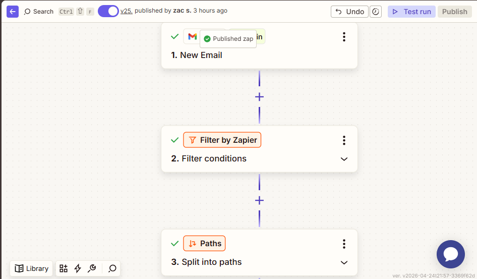
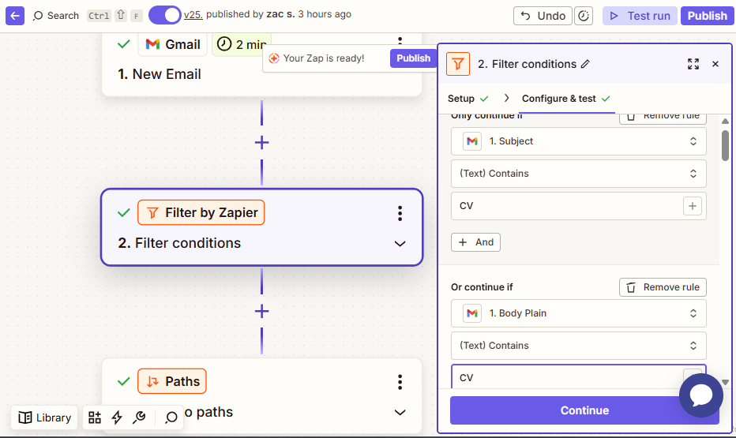
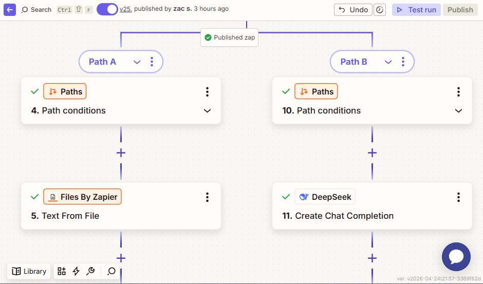
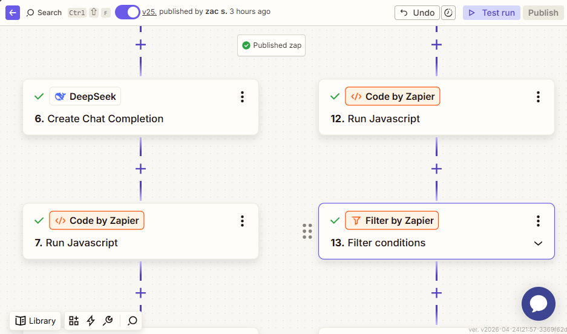
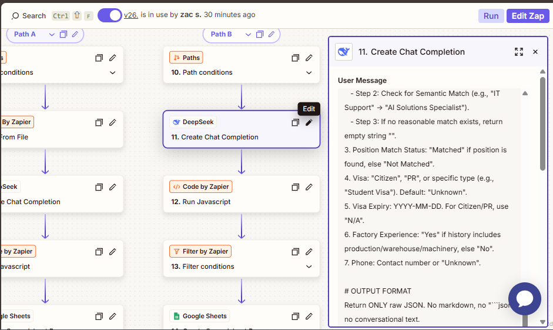
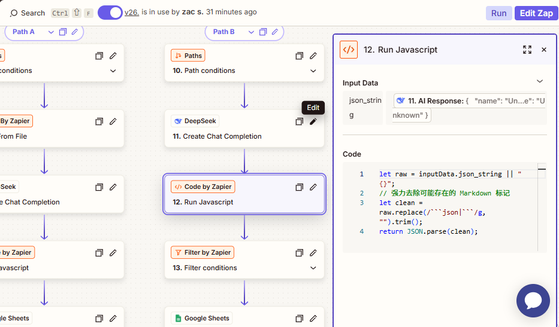
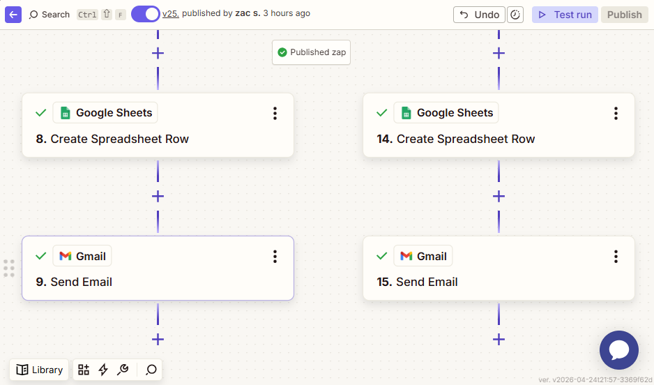
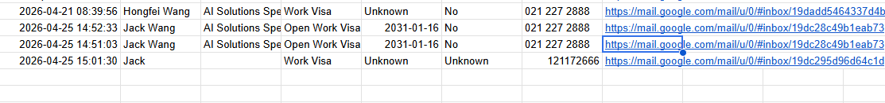
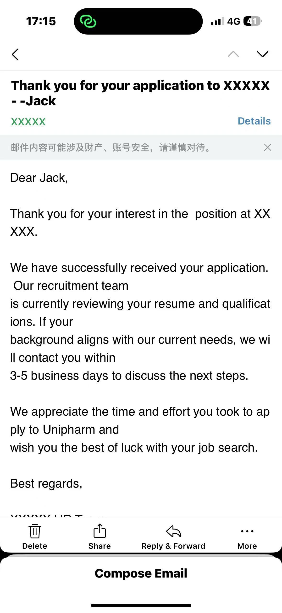

# AI-Powered Recruitment Automation System

This project demonstrates a fully automated HR recruitment pipeline. It integrates **Gmail**, **Zapier Paths**, **DeepSeek-V3 (LLM)**, and **JavaScript** middleware to transform unstructured resumes into structured database entries with automated candidate engagement.

## 🚀 System Impact
- **Instant Processing**: Reduces resume screening time from minutes to seconds.
- **Semantic Intelligence**: Maps diverse candidate backgrounds to 24 specific job roles.
- **High Reliability**: Custom JS logic ensures 100% data integrity before database insertion.

---

## 🛠️ Step-by-Step Workflow Analysis

### Phase 1: Entry & Smart Filtering
The system triggers upon receiving a new email. To save API costs and ensure data quality, a strict filter is applied immediately.

**1. Main Entry (Steps 1-3)**
The pipeline starts with a Gmail trigger followed by initial filtering and path initialization.


**2. Trigger Logic Configuration**
The system only proceeds if the email subject or body contains specific keywords (e.g., "CV"), filtering out non-recruitment emails.


---

### Phase 2: Dynamic Path Routing
Candidates submit applications either as email text or as attachments. The system detects this and routes data accordingly.

**3. Dual-Path Architecture**
Path A handles file attachments; Path B handles plain text within the email body.


**4. Attachment Detection Logic**
The system checks the "Boolean" status of attachments to decide the processing route.


---

### Phase 3: AI Extraction & Data Cleaning
This is the "Brain" of the system. We use LLMs to understand the resume and JavaScript to fix the formatting.

**5. Processing & Extraction (Steps 6-13)**
AI parses the content, followed by a code step to ensure the output is valid JSON.


**6. AI Instruction (Prompt Engineering)**
DeepSeek-V3 is configured with a strict system prompt to extract Name, Visa, Expiry, and Factory Experience while performing semantic role matching.


**7. JavaScript Middleware**
A custom script strips Markdown artifacts (like ```json) and validates the object structure to prevent database crashes.


---

### Phase 4: Finalization & Engagement
The final stage ensures the recruiter sees the data and the candidate receives a confirmation.

**8. Completion Steps (Steps 8-15)**
The structured data is written to the spreadsheet, and a personalized reply is sent.


**9. Structured Database (The Output)**
The final result: Clean, searchable, and standardized rows in Google Sheets.


**10. Automated Candidate Interaction**
A professional confirmation email is sent back to the candidate, confirming their application has been received.


---

## 📂 Project Structure
- **/assets**: High-resolution workflow and configuration screenshots.
- **/prompts**: [System instructions for the LLM](./prompts/system-prompt.md).
- **/scripts**: [JavaScript data-cleaning middleware](./scripts/data-cleaner.js).
